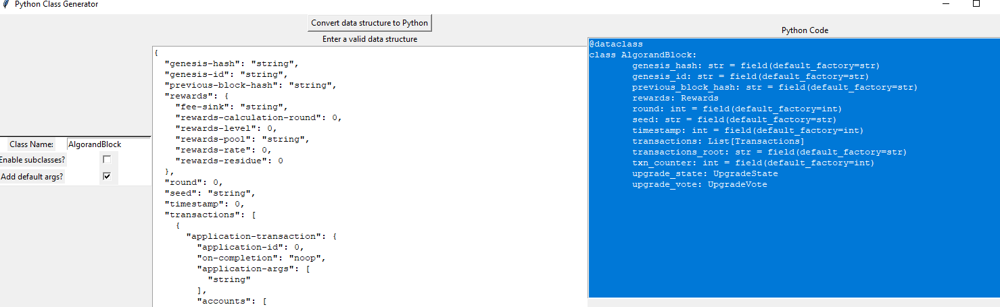

# Data Class Generator Project
This project is to try and make some utilties to autogenerate boilerplate Python classes from arbitrary json data.

### Motivation for this project
The reason I decided to do this was because that I found it very frustrating working with external API's and other data
sources, because I would often write code that works with external data sources such as AWS or CloudFlare API's, and 
my python code would look like a very hard to read series of dictionary references.  
In addition, the result of this was that the actual functions on the data structures from external API's wouldn't be
properly organized, since it always feel more natural to have the functions on data structures to be associated with the
structures themselves.

### What does this project do?
It takes in a python data structure in the form of a json file or python object and generates a python data class from it.

### Usage
The main implementation so far is in just in a Tkinter app, since I wanted to make an easy tool I could run locally. 
Might put this behind an API later so it can be part of a web app. Currently you just paste a valid json into the text window: 

When I was working on this project I was writing some code to interact with the Algorand blockchain, so I wanted to be 
able to represent the deeply nested data structures. Pasting in the data from [tests/test_data/algoblock.json](tests/test_data/algoblock.json)
we get a complex output:



The code output is below:  

```python
from dataclasses import dataclass, field

@dataclass
class UpgradeVote:
	upgrade_approve: bool = field(default_factory=bool)
	upgrade_delay: int = field(default_factory=int)
	upgrade_propose: str = field(default_factory=str)

@dataclass
class UpgradeState:
	current_protocol: str = field(default_factory=str)
	next_protocol: str = field(default_factory=str)
	next_protocol_approvals: int = field(default_factory=int)
	next_protocol_switch_on: int = field(default_factory=int)
	next_protocol_vote_before: int = field(default_factory=int)

@dataclass
class Multisig:
	subsignature: List[Dict] = field(default_factory=list)
	threshold: int = field(default_factory=int)
	version: int = field(default_factory=int)

@dataclass
class MultisigSignature:
	subsignature: List[Dict] = field(default_factory=list)
	threshold: int = field(default_factory=int)
	version: int = field(default_factory=int)

@dataclass
class Logicsig:
	args: List[str] = field(default_factory=list)
	logic: str = field(default_factory=str)
	multisig_signature: MultisigSignature
	signature: str = field(default_factory=str)

@dataclass
class Signature:
	logicsig: Logicsig
	multisig: Multisig
	sig: str = field(default_factory=str)

@dataclass
class PaymentTransaction:
	amount: int = field(default_factory=int)
	close_amount: int = field(default_factory=int)
	close_remainder_to: str = field(default_factory=str)
	receiver: str = field(default_factory=str)

@dataclass
class KeyregTransaction:
	non_participation: bool = field(default_factory=bool)
	selection_participation_key: str = field(default_factory=str)
	vote_first_valid: int = field(default_factory=int)
	vote_key_dilution: int = field(default_factory=int)
	vote_last_valid: int = field(default_factory=int)
	vote_participation_key: str = field(default_factory=str)

@dataclass
class AssetTransferTransaction:
	amount: int = field(default_factory=int)
	asset_id: int = field(default_factory=int)
	close_amount: int = field(default_factory=int)
	close_to: str = field(default_factory=str)
	receiver: str = field(default_factory=str)
	sender: str = field(default_factory=str)

@dataclass
class AssetFreezeTransaction:
	address: str = field(default_factory=str)
	asset_id: int = field(default_factory=int)
	new_freeze_status: bool = field(default_factory=bool)

@dataclass
class Params:
	clawback: str = field(default_factory=str)
	creator: str = field(default_factory=str)
	decimals: int = field(default_factory=int)
	default_frozen: bool = field(default_factory=bool)
	freeze: str = field(default_factory=str)
	manager: str = field(default_factory=str)
	metadata_hash: str = field(default_factory=str)
	name: str = field(default_factory=str)
	name_b64: str = field(default_factory=str)
	reserve: str = field(default_factory=str)
	total: int = field(default_factory=int)
	unit_name: str = field(default_factory=str)
	unit_name_b64: str = field(default_factory=str)
	url: str = field(default_factory=str)
	url_b64: str = field(default_factory=str)

@dataclass
class AssetConfigTransaction:
	asset_id: int = field(default_factory=int)
	params: Params

@dataclass
class GlobalStateSchema:
	num_uint: int = field(default_factory=int)
	num_byte_slice: int = field(default_factory=int)

@dataclass
class LocalStateSchema:
	num_uint: int = field(default_factory=int)
	num_byte_slice: int = field(default_factory=int)

@dataclass
class ApplicationTransaction:
	application_id: int = field(default_factory=int)
	on_completion: str = field(default_factory=str)
	application_args: List[str] = field(default_factory=list)
	accounts: List[str] = field(default_factory=list)
	foreign_apps: List[int] = field(default_factory=list)
	foreign_assets: List[int] = field(default_factory=list)
	local_state_schema: LocalStateSchema
	global_state_schema: GlobalStateSchema
	approval_program: str = field(default_factory=str)
	clear_state_program: str = field(default_factory=str)
	extra_program_pages: int = field(default_factory=int)

@dataclass
class Transactions:
	application_transaction: ApplicationTransaction
	asset_config_transaction: AssetConfigTransaction
	asset_freeze_transaction: AssetFreezeTransaction
	asset_transfer_transaction: AssetTransferTransaction
	auth_addr: str = field(default_factory=str)
	close_rewards: int = field(default_factory=int)
	closing_amount: int = field(default_factory=int)
	confirmed_round: int = field(default_factory=int)
	created_application_index: int = field(default_factory=int)
	created_asset_index: int = field(default_factory=int)
	fee: int = field(default_factory=int)
	first_valid: int = field(default_factory=int)
	genesis_hash: str = field(default_factory=str)
	genesis_id: str = field(default_factory=str)
	group: str = field(default_factory=str)
	id: str = field(default_factory=str)
	intra_round_offset: int = field(default_factory=int)
	keyreg_transaction: KeyregTransaction
	last_valid: int = field(default_factory=int)
	lease: str = field(default_factory=str)
	note: str = field(default_factory=str)
	payment_transaction: PaymentTransaction
	receiver_rewards: int = field(default_factory=int)
	rekey_to: str = field(default_factory=str)
	round_time: int = field(default_factory=int)
	sender: str = field(default_factory=str)
	sender_rewards: int = field(default_factory=int)
	signature: Signature
	tx_type: str = field(default_factory=str)
	local_state_delta: List[Dict] = field(default_factory=list)
	global_state_delta: List[Dict] = field(default_factory=list)
	logs: List[str] = field(default_factory=list)
	inner_txns: List[str] = field(default_factory=list)

@dataclass
class Rewards:
	fee_sink: str = field(default_factory=str)
	rewards_calculation_round: int = field(default_factory=int)
	rewards_level: int = field(default_factory=int)
	rewards_pool: str = field(default_factory=str)
	rewards_rate: int = field(default_factory=int)
	rewards_residue: int = field(default_factory=int)

@dataclass
class AlgorandBlock:
	genesis_hash: str = field(default_factory=str)
	genesis_id: str = field(default_factory=str)
	previous_block_hash: str = field(default_factory=str)
	rewards: Rewards
	round: int = field(default_factory=int)
	seed: str = field(default_factory=str)
	timestamp: int = field(default_factory=int)
	transactions: List[Transactions]
	transactions_root: str = field(default_factory=str)
	txn_counter: int = field(default_factory=int)
	upgrade_state: UpgradeState
	upgrade_vote: UpgradeVote
```

You can then use the generated classes to write strongly typed code and use IDE hints to handle the complexity for you.
In practice this isn't fully functional and you need to hack around the limitations of Python a bit so that they instantiate
properly, but the code generation is a start. 

### TODO:
This was really just a personal tool, some work still to be done:
* Make this more useable, the generated classes are don't instantiate without some hacking. This is done in practice in
[a different project](https://github.com/ianm199/AlgorandIndexerAPIWrapper/tree/master/models) I worked on.
* Distribute with Docker
* Add setup.py/ pypl
* Add proper error handling indications to the UI
* Make into web app